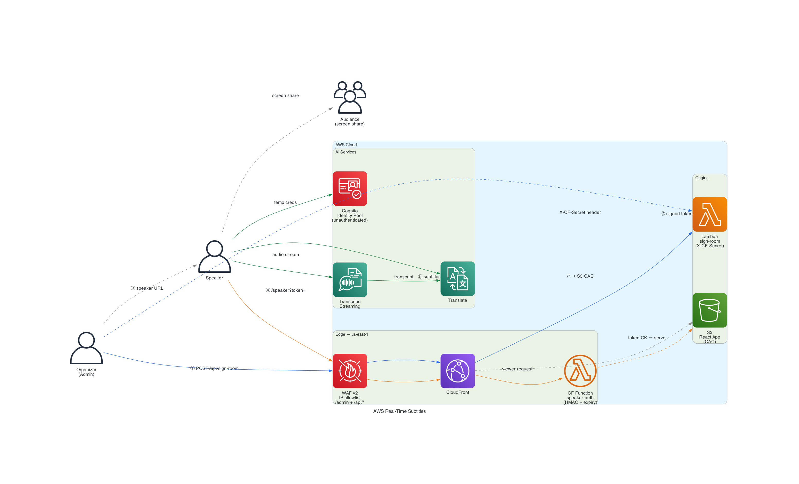

# AWS Real-Time Subtitles

Real-time speech-to-text and translation for live events. Speaker talks into their mic, translated subtitles appear fullscreen on their screen, and the audience reads them via screen share.

Fork this repo, run the bootstrap once, trigger a GitHub Actions workflow, and you have your own deployment in your AWS account.

## Architecture



### How it works

**Organizer creates a room:**
1. Opens `/admin` from an allowed IP. WAF blocks everyone else.
2. Submits the form, which hits `POST /api/sign-room`. WAF checks the IP again, CloudFront proxies to Lambda and injects a shared secret header (`X-CF-Secret`). Lambda validates the header before processing; the Lambda URL is never exposed in the browser bundle.
3. Lambda signs a token: `base64url(payload) + "." + base64url(HMAC-SHA256(payload, SIGNING_SECRET))`
4. AdminView builds the speaker URL and shows a copy button.

**Speaker presents:**
1. Opens the signed URL. CloudFront Function validates the HMAC and 8h expiry at the edge.
2. Clicks Start mic. Browser calls `getUserMedia({ audio: true })`.
3. Cognito Identity Pool issues temporary IAM credentials scoped to Transcribe and Translate only.
4. Browser opens a WebSocket audio stream to Amazon Transcribe Streaming.
5. Transcribe returns partial and final transcripts. Final phrases go to Amazon Translate.
6. Translated text appears fullscreen. Audience watches via screen share, no separate URL or login.

## Cost

All costs are pay-as-you-go. WAF is the only fixed charge.

**Fixed (always running): ~$6/month**
- WAF WebACL: $5/month
- WAF rule: $1/month
- S3 + CloudFront static requests: < $0.01/month

**Per active speaker: ~$2.40/hour**
- Transcribe Streaming: $0.024/min
- Translate: ~$0.95/hr (approx. 63k chars at 150 wpm)

| Example | Cost |
|---------|------|
| 1 speaker, 1 hour | ~$2.41 |
| 1 speaker, full day (8h) | ~$19.28 |
| 5 speakers, 2 hours each | ~$24.08 |
| 10 speakers, 4 hours each | ~$96.32 |

Idle cost between events is ~$0.008/hour (WAF only). Run the `destroy` workflow when not in use to bring it to $0.

Both services have AWS Free Tier quotas that may cover small events in the first year.

## Prerequisites

- AWS account with admin access (bootstrap only)
- GitHub repository (forked from this one)
- AWS CloudShell or a local Terraform install

## Deployment

### Step 1: Bootstrap (once per account)

Run from AWS CloudShell or anywhere with AWS credentials and Terraform.

```bash
# Install Terraform in CloudShell (skip if already installed)
curl -fsSL https://releases.hashicorp.com/terraform/1.9.0/terraform_1.9.0_linux_amd64.zip -o tf.zip
unzip -o tf.zip && mv terraform ~/.local/bin/ && rm tf.zip

# Clone your fork
git clone https://github.com/<your-org>/aws-real-time-subtitles.git
cd aws-real-time-subtitles

cp terraform/bootstrap/terraform.tfvars.example terraform/bootstrap/terraform.tfvars
# Edit: set prefix, aws_region, github_repo
# If a GitHub OIDC provider already exists in your account: set create_oidc_provider = false

cd terraform/bootstrap
terraform init
terraform apply
```

The output tells you exactly what to configure in GitHub:

```
github_secrets = {
  AWS_ACCOUNT_ID = "123456789012"
  SIGNING_SECRET = "(generate with: openssl rand -hex 32)"
}
github_variables = {
  TF_PREFIX       = "myevent"
  AWS_REGION      = "us-east-1"
  TF_STATE_BUCKET = "myevent-tfstate-123456789012"
  TF_LOCK_TABLE   = "myevent-tflock"
  AWS_ROLE_ARN    = "arn:aws:iam::123456789012:role/myevent-github-actions"
  ADMIN_IPS       = "(your public IP + /32)"
}
```

### Step 2: Configure GitHub

In your forked repository:

**Secrets** (`Settings > Secrets > Actions`):
| Secret | Value |
|--------|-------|
| `AWS_ACCOUNT_ID` | from bootstrap output |
| `SIGNING_SECRET` | `openssl rand -hex 32`, keep it private |
| `CLOUDFRONT_ORIGIN_SECRET` | `openssl rand -base64 32`, keeps Lambda URL inaccessible without going through CloudFront |

**Variables** (`Settings > Variables > Actions`):
| Variable | Value |
|----------|-------|
| `TF_PREFIX` | from bootstrap output |
| `AWS_REGION` | from bootstrap output |
| `TF_STATE_BUCKET` | from bootstrap output |
| `TF_LOCK_TABLE` | from bootstrap output |
| `AWS_ROLE_ARN` | from bootstrap output |
| `ADMIN_IPS` | comma-separated IPv4 CIDRs, e.g. `1.2.3.4/32`. Check with `curl -4 -s https://checkip.amazonaws.com` |
| `ADMIN_IPS_V6` | (optional) comma-separated IPv6 CIDRs if your browser connects via IPv6. Check with `curl -6 -s https://checkip.amazonaws.com` |
| `ALERT_EMAIL` | (optional) email for a cost alert at $20/month |

### Step 3: Deploy

Go to `Actions > deploy > Run workflow`.

When it finishes, the `app_url` Terraform output is your CloudFront URL (e.g. `https://dXXXXXXXXXXXX.cloudfront.net`). No custom domain by default.

## Usage

### Organizer

1. Open `<app_url>/admin` from your configured IP.
2. Fill in the room label, speaker language, and subtitle language.
3. Click **Generate speaker URL**.
4. Send the URL to the speaker.

There is no database. The generated URLs only exist in the AdminView tab. If you close the tab, you lose the list, but any URLs already sent to speakers remain valid for their full 8h. Speaker sessions run entirely in the speaker's own browser and are not affected by the organizer closing the admin tab.

### Speaker

1. Open the signed URL in any modern browser (Chrome, Firefox, Edge).
2. Grant microphone access when prompted.
3. Click **Start mic**.
4. Share your screen.
5. Speak. Subtitles appear within about 2 seconds.
6. Click **Stop** when done.

Speaker URLs are valid for 8 hours from when the organizer generated them.

## Teardown

```
Actions > destroy > Run workflow
```

This empties the S3 app bucket and runs `terraform destroy`.

> The state bucket and DynamoDB lock table created by bootstrap have `prevent_destroy = true` and are not removed by the destroy workflow. Delete them manually if you no longer need them.

## Updating your IP

Change `ADMIN_IPS` in GitHub Variables and re-run the `deploy` workflow. Terraform updates the WAF IP set.

## License

MIT. See [LICENSE](LICENSE).